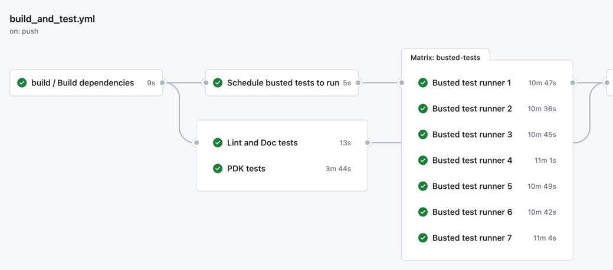

# Kong Gateway test scheduler and runner

The GitHub Actions in this repository establish an automated system
for scheduling the execution of Kong Gateway integration and unit
tests through the Busted framework. To optimize overall runtime, the
tests are distributed across multiple parallel runners. This
optimization is accomplished by leveraging runtime information
collected from previous test runs to predict the duration of each
test. Subsequently, all tests are distributed across a predetermined
number of runners, ensuring that each runner executes for an
equivalent duration.

A recurring GitHub Workflow processes runtime information from
previous tests by collecting actual runtime data from workflow runs in
the past seven days. It calculates the median runtime for each test,
utilizing this value as the predicted runtime for
scheduling. Subsequently, these predicted runtimes are stored in a
dedicated storage GitHub repository, ready to be retrieved by the test
runner.

## The "Build & Test" Workflow

The "Build & Test" workflow triggers the "Schedule busted tests to
run" job, distributing tests among a set of runners.
This job first fetches the predicted runtimes file from a dedicated
storage repository and then executes the `schedule` Action. The action
assembles a test list from a definition file in the Gateway repository,
and using both this list and the runtime prediction file, it creates
distinct files for each runner, specifying the tests to run. These
files are subsequently uploaded to a GitHub artifact, facilitating
retrieval by the runner jobs.
The number of runners can also be configured in this action using the
`runner-count` input parameter.
The `schedule` action needs to access the storage repository that holds
the runtimes file in order to balance tests based on their execution
times. To enhance robustness and minimize dependencies on external
systems, the action provides a `static-mode` input parameter. Enabling
this allows the system to operate autonomously without relying on
external dependencies, conducting a more basic scheduling process that
does not rely on test runtime information.
`static-mode` gets enabled in "Build & Test" when the "Schedule busted
tests to run" job is retried.

The "Busted test runner" job utilizes its ordinal number to choose the
relevant control file from the GitHub artifact. Subsequently, it
executes tests sequentially, recording the execution time for each
test file in a "runtime log" file.
Test failures are detected by capturing the events generated by Busted,
in case of `failure` or `error` events, these are propagated with an
exit status of 1, causing the job to fail. Busted is executed without
the `--no-keep-going` flag, so the tests execution does not stop when
there are failures.
In case of test failure, the specification is documented in a "failed"
file. Upon completion of all tests, both the "runtime log" and "failed"
files are uploaded to GitHub artifacts. When a runner is rerun owing to
test failures, the "failed" file serves as the control file, ensuring
only the failed tests are re-executed.

## The "Predict Runtimes" Workflow

The "Process statistics" step retrieves the "runtime log" files
generated over the past 7 days from the GitHub artifact
store. Subsequently, it generates a runtime prediction file in the
local file system. The "Upload new runtimes file" step commits this
file to the dedicated storage repository, making it available to the
"Build & Test" workflow.
